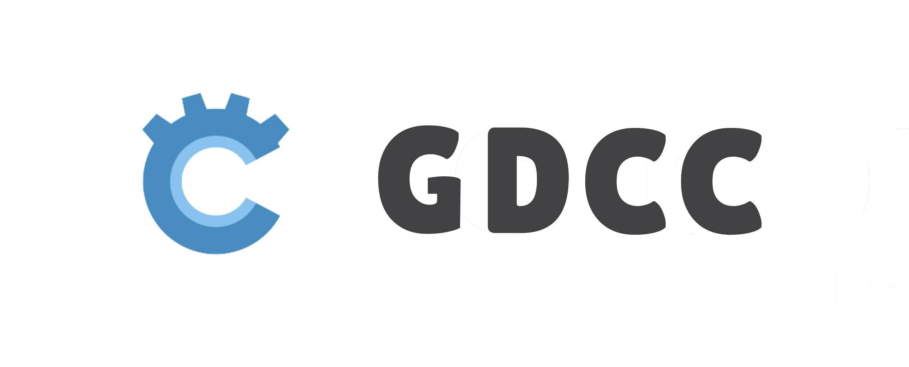

**GDCC: *GD*script to *C* *C*ompiler**

其他语言版本：[English](README.md)

GDCC 是一个将 GDScript 编译为 GDExtension 本机二进制模块的编译器，通过 Godot 引擎的本机二进制接口安全且高效地 GDScript。

从现在起，编写 GDScript，获取类似 C/C++ 原生模块的安全性与性能！

-----

# 特性

- 可拓展的架构：解析器、语义分析器、IR转换器(WIP)、中间表示、后端生成器、交叉编译模块化设计
- 反编译安全：为 GDScript 生成本机二进制模块，根源上保护源码不泄露
- 高性能：直接生成高效的静态 GDExtension 调用，避免兼容层和动态派发的性能损失
- 渐进式迁移：兼容大部分弱类型代码，允许逐步迁移到更严格的类型系统以获得更高性能

# 状态

目前 GDCC 项目仍处于 pre-alpha 阶段，核心架构已完成，IR转换器等模块仍处在实现中。  

目前仅可通过API调用功能，欢迎开发者加入测试和贡献代码！

# 架构

- `gdcc.frontend.parse`：可容错的增量GDScript解析器，生成AST（抽象语法树）
- `gdcc.frontend.sema`：语义分析器，进行类型检查、作用域分析等，生成带有类型信息的AST
- `gdcc.frontend.lowering`：将高层AST转换为IR（中间表示）
- `gdcc.gdextension`：GDExtension签名解析器、校验器以及相关工具
- `gdcc.type`：完整的Godot类型系统实现，包括内置类型、用户定义类型、泛型等
- `gdcc.scope`：类型校验、作用域和符号表实现，支持嵌套作用域、闭包等
- `gdcc.lir`：线性中间表示，以统一的方式表示所有可在GDScript中表达的操作和控制流
- `gdcc.backend.c.gen`：将LIR转换为C代码的生成器
- `gdcc.backend.c.build`：面向PC、移动和web的交叉编译到GDExtension模块的构建工具链

# 社区

- QQ群：1082512847
